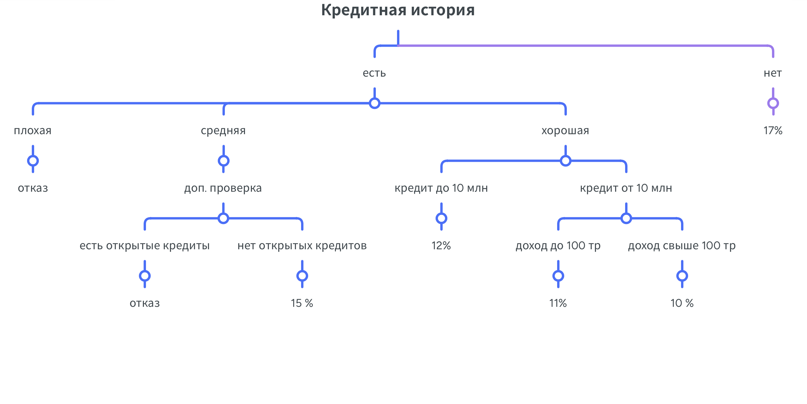
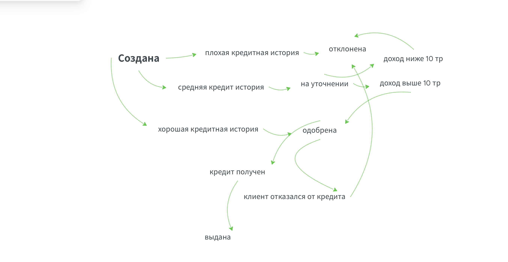

# QA-практика: тестирование интернет-магазина «Книги Рум»

## О проекте
Данная практическая работа выполнена с целью **отработки навыков составления тестовой документации и применения техник тест-дизайна** на учебном сайте [Книги Рум](http://188.120.241.222).

---

## Что выполнено

### 1. Анализ требований
- Выявлены нарушения критериев качества требований к системе скидок (непротиворечивость, полнота, проверяемость, недвусмысленность)
- Предложены рекомендации по улучшению требований
- Сформулированы вопросы для уточнения
- Проведён анализ модифицируемости

📄 [Анализ требований](analysis/requirements-analysis.md)

---

### 2. Тест-кейсы и чек-листы
- Составлены тест-кейсы для проверки функциональности корзины
- Разработаны чек-листы для тестирования корзины и фильтров (включая комбинации фильтров, сортировки и поиска)

📄 [Тест-кейсы корзины](test-cases/cart-test-cases.md)  
📄 [Чек-лист корзины](checklists/cart-checklist.md)  
📄 [Чек-лист фильтров](checklists/filters-checklist.md)

---

### 3. Баг-репорты
- Оформлены баг-репорты по найденным дефектам (с шагами воспроизведения, ожидаемым и фактическим результатом, окружением, приоритетом)

📄 [Баг-репорт: поиск с маленькой буквы](bug-reports/bug-search-case-sensitive.md)  
📄 [Баг-репорт: раскрытие вопросов в FAQ](bug-reports/bug-faq-accordion.md)

---

### 4. Применение техник тест-дизайна

| Техника | Где применялась |
|---------|-----------------|
| Эквивалентное разделение | Расчёт стоимости, валидация фамилии, даты, категории товаров |
| Граничные значения | Все задания по эквивалентному разделению |
| Таблица решений | Расчёт стоимости номера в отеле, расчёт скидок |
| Дерево решений | Расчёт кредитной ставки |
| Схема состояний и переходов | Проверка статусов заказа |

#### Визуализация техник

| Техника | Визуализация |
|---------|--------------|
| Дерево решений |  |
| Схема состояний |  |

📂 [Все задания по эквивалентному разделению](test-design-techniques/equivalence-partitioning/)  
📂 [Таблицы решений](test-design-techniques/decision-table/)  
📄 [Дерево решений](test-design-techniques/decision-tree/credit-rate.md)  
📄 [Схема состояний](state-transition-diagram/credit-application.md)

---

## Структура репозитория

| Папка | Содержание |
|-------|------------|
| `analysis/` | Анализ требований к системе скидок |
| `test-cases/` | Тест-кейсы для корзины |
| `checklists/` | Чек-листы (корзина, фильтры) |
| `bug-reports/` | Баг-репорты |
| `test-design-techniques/equivalence-partitioning/` | Задачи по классам эквивалентности и граничным значениям |
| `test-design-techniques/decision-table/` | Таблицы решений (отель, скидки) |
| `state-transition-diagram/` | Схема состояний и переходов |
| `screenshots/` | Скриншоты к визуализациям |

---

## Выводы
- Навыки составления тестовой документации закреплены на практике
- Применены ключевые техники тест-дизайна для повышения покрытия и эффективности проверок
- Выявлены противоречия и неоднозначности в требованиях, предложены улучшения
- Найдены и задокументированы баги, включая дефекты на граничных значениях

---

## Контакты
- GitHub: [lexi1509](https://github.com/lexi1509)
- Telegram: @Alexi1509
